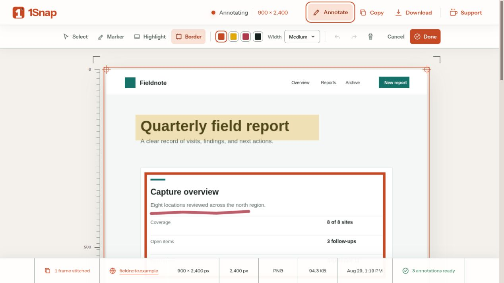
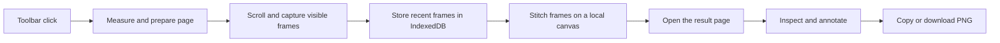

# 1Snap

> Full-page screenshots from Chrome, stitched locally into one reusable PNG.

[](https://www.supportkori.com/montasim)
[](LICENSE)

1Snap is a focused Chrome extension for people who need the whole page, not only the
visible viewport. One toolbar click captures a regular web page from top to bottom, restores
the original scroll position, stitches the frames locally, and opens a dedicated result page
for inspection, annotation, copying, or downloading.



## Why 1Snap?

Browser screenshots normally stop at the viewport, while many full-page tools add heavy editing
suites, accounts, or cloud storage around a simple job. 1Snap keeps the workflow deliberately
small:

- Start one capture from the Chrome toolbar.
- Let the extension scroll, measure, and restore the page.
- Receive one PNG on a screenshot-first result page.
- Keep capture frames and processing inside the browser.

## Key capabilities

- Full vertical capture of regular `http` and `https` pages
- Automatic handling of scroll positions and repeated fixed or sticky elements
- Local frame storage and in-browser PNG stitching
- Non-destructive marker, highlight, and border annotations with local autosave
- Selection, movement, resizing, color and width controls, undo, redo, clear, cancel, and done
- Copy and download actions with clear success or recovery notices
- Original-resolution annotated PNG export through both Copy and Download
- Measured result view with dimensions, height, file size, source, time, and frame count
- Responsive loading, ready, and error states
- SupportKori links on both the product website and extension result page

## Install the extension locally

### Prerequisites

- Node.js 24
- pnpm 11.7.0
- Google Chrome 120 or later

### Build

```bash
pnpm install
pnpm build:extension
```

The unpacked Chrome extension is written to `apps/extension/.output`.

### Load in Chrome

1. Open `chrome://extensions`.
2. Enable **Developer mode**.
3. Select **Load unpacked**.
4. Choose `apps/extension/.output`.
5. Pin 1Snap to the toolbar.

## Capture a page

1. Open a normal web page and keep its tab active.
2. Click the 1Snap toolbar icon.
3. Keep the page active while the toolbar badge reports progress.
4. Use the new result tab to inspect, annotate, copy, or download the final PNG.

1Snap restores the page's original scroll position and temporarily changed presentation
after the capture finishes or stops.

## How it works



The background capture controller coordinates the active tab, capture rate, progress badge,
and recovery. A page script pauses animation, waits for visible images and fonts, manages
fixed or sticky elements, and restores the page afterward. The result tab reads the saved
capture, draws the frames onto a canvas, and exposes the finished PNG. Annotations stay as local
vector data while editing and are composed into the original-resolution PNG only for Copy or
Download.

## Privacy and permissions

1Snap does not require an account, analytics service, cloud upload, or remote processing.
The three newest captures and their annotations are retained in extension-owned IndexedDB storage
so their result tabs can be assembled locally; older records are pruned automatically.

| Permission         | Why it is needed                                              |
| ------------------ | ------------------------------------------------------------- |
| `activeTab`        | Capture only the page the user explicitly activates 1Snap on  |
| `scripting`        | Measure, scroll, stabilize, and restore that page             |
| `clipboardWrite`   | Copy the finished PNG to the clipboard                        |
| `unlimitedStorage` | Hold large local image frames while stitching recent captures |

## Project structure

```text
apps/
├── extension/   WXT Manifest V3 extension, capture pipeline, result UI, and tests
└── web/         Vite and React product website, social preview, and favicon tooling
```

| Area             | Technology                                 |
| ---------------- | ------------------------------------------ |
| Extension        | WXT, Chrome Manifest V3, React, TypeScript |
| Website          | Vite, React, TypeScript                    |
| Image processing | Browser Canvas API and Sharp build scripts |
| Storage          | IndexedDB                                  |
| Tests            | Vitest, Testing Library, Happy DOM         |
| Workspace        | pnpm                                       |

## Development

```bash
pnpm install
pnpm dev:extension
```

Run the website separately with:

```bash
pnpm dev:web
```

| Command                  | Purpose                                                      |
| ------------------------ | ------------------------------------------------------------ |
| `pnpm dev:extension`     | Start WXT extension development mode                         |
| `pnpm dev:web`           | Start the product website on port 3000                       |
| `pnpm build:extension`   | Build the unpacked production extension                      |
| `pnpm build:web`         | Generate website assets and create the Vite production build |
| `pnpm typecheck`         | Type-check both applications                                 |
| `pnpm test`              | Run the extension test suite                                 |
| `pnpm format:check`      | Verify Prettier formatting                                   |
| `pnpm check`             | Run formatting, types, tests, and both production builds     |
| `pnpm release:extension` | Build a versioned Chrome ZIP and SHA-256 checksum            |
| `pnpm verify:release`    | Inspect the ZIP, manifest, required files, and checksum      |

## Release process

1Snap follows semantic version tags. Before creating a tag:

1. Update the matching versions in the root and application package manifests.
2. Add the user-facing changes to `CHANGELOG.md` and `docs/releases/vX.Y.Z.md`.
3. Run `pnpm check`.
4. Run `pnpm release:extension` and `pnpm verify:release`.
5. Inspect the generated files in `release/`.

The tag-triggered GitHub workflow repeats the validation, packages the extension, verifies the
checksum and manifest, and publishes the ZIP plus checksum as release assets.

## Netlify deployment

The product website is ready for a root-level Netlify monorepo build:

| Setting           | Value                                          |
| ----------------- | ---------------------------------------------- |
| Build command     | `pnpm build:web`                               |
| Publish directory | `apps/web/dist`                                |
| Node.js           | 24                                             |
| Production URL    | [1snap.netlify.app](https://1snap.netlify.app) |

These settings are committed in `netlify.toml`. Netlify's production `URL` build variable is
injected into the canonical and social metadata during the Vite build. The site source and
generated output contain no Netlify badge or provider-branded footer.

The production site is deployed at [1snap.netlify.app](https://1snap.netlify.app).

## Status and limitations

1Snap `0.1.1` is a pre-release and is not yet listed in the Chrome Web Store.

- Chrome-owned pages, extension pages, and other restricted URLs cannot be captured.
- The source tab must remain active while Chrome captures each visible frame.
- A capture is limited to 50 frames.
- Output is constrained to 16,000 pixels wide, 32,000 pixels high, and 120 million pixels;
  larger captures are proportionally downscaled.
- Dynamic pages can change while 1Snap scrolls, so live content may not remain identical
  between frames.
- Transparent page backgrounds are flattened onto white in the PNG.

## Support and security

Read [SUPPORT.md](SUPPORT.md) for capture-reporting details and supported help paths. Report
security concerns privately according to [SECURITY.md](SECURITY.md); do not include sensitive
page content in a public report.

Source code, issues, and published releases are available in the
[1Snap GitHub repository](https://github.com/montasim/1Snap).

## Contributing

Contributions are welcome. Read [CONTRIBUTING.md](CONTRIBUTING.md) for the local workflow,
required checks, and result-page verification checklist.

## Funding

Optional support helps maintain browser compatibility, release verification, and capture
quality. [Support 1Snap on SupportKori](https://www.supportkori.com/montasim).

Bug reports, documentation improvements, and code contributions are equally valuable.

## Author

Built and maintained by [Montasim](https://github.com/montasim).

## License

1Snap is available under the [MIT License](LICENSE).
